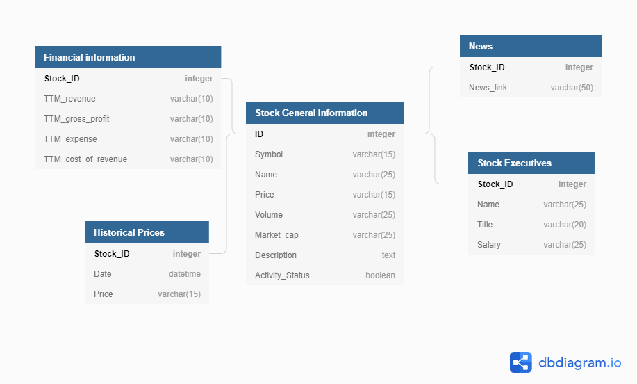

## ERD and information

### Main Table

**Stock General Information:**
* Contains general data regarding current stock:
    * ID - unique ID per stock, serves as PK 
    * symbol - stock initials, uppercase letters - (also used in case of calling a specific symbol in the CLI) 
    * Name - full stock name
    * Price - stock's current price 
    * Volume - stock's current volume
    * Market_cap - stock's current market cap
    * Description - stock's profile description
    * Activity_status - 
        * 1 : currently in the most active stocks' list, 
        * 0 : currently **not** in the most active stocks' list.

### Related Tables

**News:**
* Contains links to recent articles related to the current stock
    * Symbol_ID - serves as FK for a current stock
    * News_link - link to the stock's article
    
    
**Stock Executives:**     
* Contains executives' information for a certain stock 
    * Symbol_ID - serves as FK for a current stock
    * Name - executive's full name
    * Title - executive's position
    * Salary - executive's salary
    
 
**Financial Information:**
* Contains financial information for a certain stock 
    * Symbol_ID - serves as FK for a current stock
    * TTM-revenue - monthly total revenue
    * TTM-gross-profit - monthly gross profit
    * TTM-expense - monthly expenses
    * TTM-cost-of-revenue - monthly cost of revenue
    
**historical_prices**
* Contains stock's price each update run of the scraping 
    * Symbol_ID - serves as FK for a current stock
    * Price - stock's price
    * Date - the timestamp for when the price was scraped
    